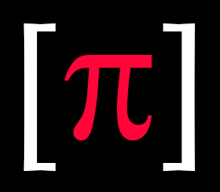
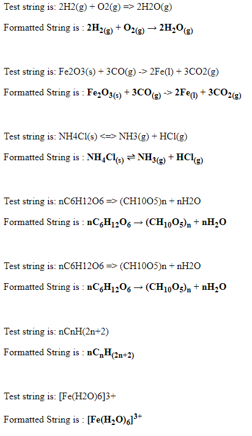

<!-- PROJECT LOGO -->
<br />
<p align="center">
  <a href="https://github.com/piyook/chemparser">
    
  </a>

  <h3 align="center">Chemical Formula Parser</h3>

  <p align="center">
    Convert an unformatted string containing a chemical formula (Molecular or Empirical) to a formated HTML string
    <br />
    <a href="https://github.com/piyook/chemparser"><strong>Explore the docs »</strong></a>
    <br />
    <br />
  </p>
</p>


<!-- TABLE OF CONTENTS -->
<details open="open">
  <summary><h2 style="display: inline-block">Table of Contents</h2></summary>
  <ol>
    <li>
      <a href="#about-the-project">About The Project</a>
      <ul>
        <li><a href="#built-with">Built With</a></li>
      </ul>
    </li>
    <li>
      <a href="#getting-started">Getting Started</a>
      <ul>
        <li><a href="#prerequisites">Prerequisites</a></li>
        <li><a href="#installation">Installation</a></li>
      </ul>
    </li>
    <li><a href="#usage">Usage</a></li>
    <li><a href="#contact">Contact</a></li>
  </ol>
</details>


<!-- ABOUT THE PROJECT -->
## About The Project
<p align="center">
 
 </p>
 <br>
 The project is a simple PHP class that is used to parse an unformatted string
 containing a chemical formula into a formatted HTML String.

 The code contains the logic to determine if the letters are Elements or state symbols,
 whether numbers should be subscript or superscript and if formula state symbols such as
 (g) or (s) are being used and should be subscript.

 The project was developed in PHP using Docker containers using a Test Driven Development approach and is passing all phpUnit tests.


### Built With

* PHP 8.0
* Docker
* PHPUnit


## Getting Started

Clone the project and run composer install to download dependencies.

### Prerequisites

Make sure that composer autoload or some other autoload method is set-up.
Developed in PHP 8.0 but should work in PHP 7.4+.


### Installation

1. Clone the repo
   ```sh
   git clone https://github.com/piyook/chemparser.git
   ```


## Usage

Load the composer autoloader

  ```sh
  require __DIR__.'/../vendor/autoload.php';
  ```

Instantiate an instance of the chemparser

   ```sh
    use App\ChemSymb\ChemParser;
    $ChemParser = new ChemParser;
  ```

The parse method returns an html string.  

  ```sh
  <p> Test string is:  nC6H12O6 => (CH10O5)n + nH2O  </p>
  <p> Formatted String is : <b> <?php echo $ChemParser->parse('nC6H12O6 => (CH10O5)n + nH2O'); ?> </b></p>
  ``` 

  You can also call the parse method directly on the class (using the __invoke magic method) by passing the string directly to the class E.g $ChemParser('string');

  ```sh
  <p> Test string is:  CuSO4(s) <=> Cu2+ SO42- </p>
 <p> Formatted String is : <b> <?php echo $ChemParser('CuSO4(s) <=> Cu2+ SO4 2-'); ?> </b></p>
  ``` 

The string can be displayed on-screen as is or further styled with css/sass.

IMPORTANT: Input formulas as simple text strings - BUT if numbers and ions are together then seperate with a space E.g SO42-(aq) should be input as SO4 2- (aq).The parser will then correctly format and remove the space.

## Contact

Piyook - [@piyookD](https://twitter.com/piyookD) - email piyook@piyook.com

Project Link: [https://github.com/piyook/chemparser](https://github.com/piyook/chemparser)


